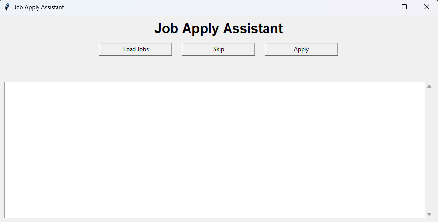

# Job Finder GUI Bot

A Python desktop application that helps you discover relevant software jobs, review them one by one, and manually choose whether to apply by email with your resume attached.

Built for targeted outreach instead of spam blasts.



## Features

* GUI desktop app (Tkinter)
* Searches jobs from JSearch / RapidAPI
* Prioritizes India + global remote jobs
* Review jobs one at a time
* Click **Apply** to send custom email
* Resume auto-attached
* SQLite database tracking
* Prevents duplicate applications
* Daily send limits
* Email templates from JSON
* Logging + safe parsing

## Folder Structure

```text
job-finder/
│── main.py
│── db.py
│── main.json
│── .env
│── resume.pdf
│── jobs.db   (auto-created)
│── README.md
```

## Requirements

* Python 3.10+
* Windows / Linux / macOS

## Installation

### 1. Clone / Download Project

```bash
git clone <your_repo>
cd job-finder
```

### 2. Create Virtual Environment (Recommended)

#### Windows

```bash
python -m venv venv
venv\Scripts\activate
```

#### Linux / macOS

```bash
python3 -m venv venv
source venv/bin/activate
```

### 3. Install Packages

```bash
pip install requests python-dotenv
```

### 4. Tkinter (Only if missing)

#### Ubuntu / Debian

```bash
sudo apt install python3-tk
```

#### Arch

```bash
sudo pacman -S tk
```

Windows usually already includes it.

## Setup `.env`

change the details in .env.example file and rename it as .env file,
also read config.example.jsonc and change details there and also rename it as config.jsonc

## Gmail SMTP Setup

Use Google App Passwords.

1. Enable 2-Step Verification
2. Go to App Passwords
3. Create password for `JobFinder`
4. Use generated 16-character password in `SMTP_PASS`

## RapidAPI Setup

1. Create an account on RapidAPI
2. Subscribe to **JSearch API**
3. Put your key in `RAPIDAPI_KEY`

## Resume Setup

Place your resume file in the project root:

```text
resume.pdf
```

## Email Templates

Edit `main.json` to customize subjects and body templates.

## Run Application

```bash
python main.py
```

## How to Use

1. Open the app
2. Click **Load Jobs**
3. Review each job listing
4. Choose:

   * **Apply**: sends email and attaches resume
   * **Skip**: moves to next listing

## Database Tracking

SQLite auto-creates `jobs.db`.

Tracks:

* company
* email
* role
* sent date
* status

Prevents duplicate applications.

## Daily Limit

Set in `.env`:

```env
DAILY_SEND_LIMIT=10
```

## Common Errors

### No module named requests

```bash
pip install requests
```

### No module named dotenv

```bash
pip install python-dotenv
```

### SMTP Login Failed

Check:

* App password correct
* 2FA enabled
* Same Gmail account used

### 403 API Error

Subscribe to JSearch on RapidAPI.

## Security

Create `.gitignore`:

```text
.env
jobs.db
venv/
__pycache__/
```

Never upload secrets publicly.

## Recommended Workflow

1. Open app
2. Load Jobs
3. Apply to top 5–10 relevant roles
4. Track replies

## Future Improvements

* Dark mode UI
* Open job links in browser
* Better recruiter email discovery
* Multi-API search
* Analytics dashboard
* Auto follow-up reminders
* Export CSV
* Cover letter variants

## Legal / Ethical Use

Use responsibly. Prefer relevant, personalized applications rather than mass unsolicited outreach.

## Author

Tanishq Dhote

## Quick Start

```bash
pip install requests python-dotenv
python main.py
```
